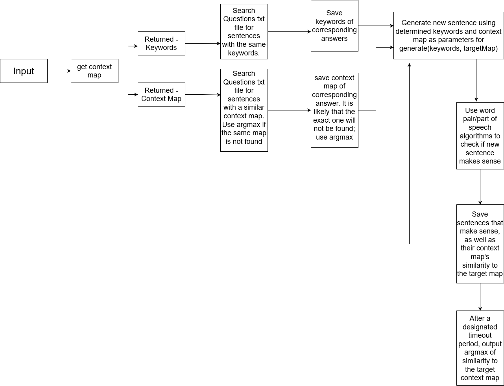
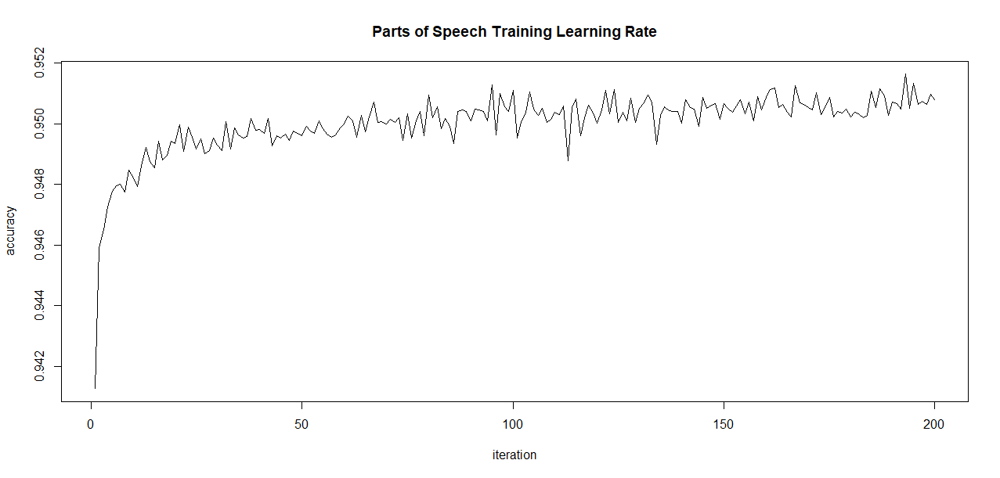
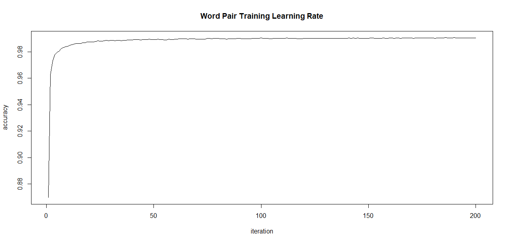

# Hydar-Claire
Claire is a chatbot for Hydar-XYZ. It is designed to be more advanced than the previous chatbot, Raye, in terms of generating sentences. On the other hand, it lacks a lot Raye's functionality with respect to determining whether one sentence is similar to another.

## How
Claire utilizes several algorithms, and several txt documents for storing training data. First, I'll go through the text documents.

### txt files
They are:
  word pair weights
  part of speech weights
  parts of speech
  questions
  responses
  training data 4
  training data 2

Word pair weights and part of speech weights are weights obtained from training. They are used in ascertaining whether a sentence is sense or nonsense. One uses parts of speech and the other uses pairs of words.

Parts of speech is a corpus of most English words with their corresponding part of speech. I downloaded it from somewhere, and made a number of modifications.

Questions and Responses correspond to data obtained from users on hydar.xyz. Each line in Responses correspones to a response made to a question in Questions.

Training data 4 is a big file on the live version. It is a collection of sentences. For github, it and several others have been chopped down to samples in order to not leak personal information.

Training data 2 is for what I call context mapping. It is a collection of sentences and their hand-made context maps. More on all that later.

### Terminology
*Context Map*
A list of word-pairs where one word in the pair is relevant to another. The words do not have to be adjacent, but they are generally kept within a certain distance from one another.
Here is an example context map for the sentence "The quick brown fox jumps over the lazy dog"
the quick brown fox jump over the lazy dog
[1, 3], ['quick', 'fox']
[2, 3], ['brown', 'fox']
[3, 4], ['fox', 'jump']
[4, 5], ['jump', 'over']
[6, 8], ['the', 'dog']
[7, 8], ['lazy', 'dog']
In this example, "quick" and "fox" are related, "brown" and "fox" are related, etc.
Different formats of the general idea of a context map are used at various points in the code. This particular one is the format of context maps used for training, found in training_data_2.
Other formats substitute the words with their corresponding part of speech, and/or the indicies with the scalar difference between indicies.

*part of speech pair/feature*
A string containing an integer distance between two parts of speech, followed by those parts of speech. All separated by spaces.
For example
'1 N V' indicates that a noun and a verb are of distance 1 from each other.

_word pair/feature_
A string containing an integer distance between two words, followed by those two words. Space is used as a delineator.
'1 the quick' indicates that "the" and "quick" appear in a sentence with distance 1 of eachother.

### Main Algorithm
This diagram should be a fairly intuitive way of understanding the main algorithm

### Training algorithms
train.py determines if a sentence makes sense using part of speech pairs as features. 
it first initializes dicts containing the probability of each part of speech pair ocurring, as well as its weight. Weights will start out at 1.

If $\frac{\sum_{n=1}^{n=k} W_nP_n}{ \sum_{n=1}^{n=k} P_n} >= 1$, (where $W_n$ is the weight of feature n, $P_n$ is the probability of feature n, and $k$ is the number of total features) then the sentence is will be classified as making sense.
If the sentence turned out to not make sense, as indicated in training data, lower weights of the features in that sentence.

If $\frac{\sum_{n=1}^{n=k}{W_nP_n}}{ \sum_{n=1}^{n=k} P_n} >= 1$, then the sentence is will be classified as being nonsense.
If the sentence turned out to actually make sense, increase the weights of the features in that sentence

train2.py does the same algorithm, but uses word pairs as features.
Data for train.py is saved in part_of_speech_weights.txt, and data for train2.py is saved in word_pair_weights.txt. The data saved is a copy of the weights dict, with no formatting other than spaces as delineators, including between key and value.

### learning rates
Measured by accuracy (correct/total), the learning rate was graphed.
Accuracy was measured after all data had been analyzed, which meant that the algorithm had already adjusted weights and became more accurate before the total accuracy was counted, so they start out quite high. However, the algorithms still perform better over a number of iterations.

